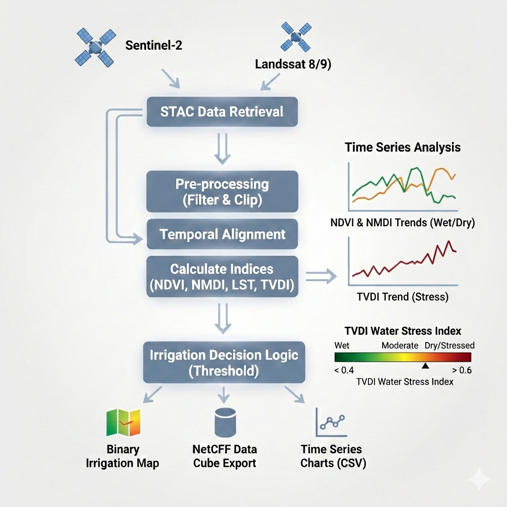

# Multi-Sensor Crop Water Stress Monitoring 🌾🛰️


[](https://www.youtube.com/@dr.nournegm)

This repository contains an open-source Python workflow for monitoring agricultural water stress in West Minya, Egypt, and generating binary irrigation decision maps. It bypasses traditional commercial platforms by leveraging the **STAC API** and **Microsoft Planetary Computer** to process cloud-native geodata.

## Project Overview

The project integrates multi-sensor satellite data and modern cloud-native geospatial tools to derive vegetation condition, land surface temperature, and drought indicators, and convert them into irrigation decision maps.

---

## Study Area

Agricultural fields in West-West Minya, Egypt  
(Center-pivot irrigation systems under arid conditions)

---

## Data Sources

* **Sentinel-2 (Optical):** Used to calculate NDVI and NMDI (Normalized Multi-band Drought Index).
* **Landsat 8/9 (Thermal):** Used to calculate Land Surface Temperature (LST).
* **Data Fusion (TVDI):** Integrates vegetation cover and surface temperature to compute the Temperature Vegetation Dryness Index (TVDI), providing a highly accurate spatial map of crop moisture stress.

All data are accessed programmatically using STAC APIs.

---
## Workflow



### 1. Data Access
- STAC search and filtering
- Cloud filtering
- Lazy loading
- Spatial clipping to AOI

### 2. Vegetation & Temperature Indicators
- NDVI (Normalized Difference Vegetation Index)
- NMDI (Normalized Multi-band Drought Index)
- LST (Land Surface Temperature)

### 3. TVDI (Temperature Vegetation Dryness Index)
TVDI is derived to normalize surface temperature relative to vegetation condition:

TVDI = (LST - LST_min) / (LST_max - LST_min)

This allows relative drought detection independent of seasonal temperature variation.

### 4. Irrigation Decision Mapping
Binary irrigation maps are generated using rule-based thresholds:

- NDVI > 0.40  
- TVDI > defined threshold  

Outputs:
- GeoTIFF irrigation maps
- Time-series analysis
- Interactive visualizations
- Exportable NetCDF dataset

---
### Core Python Libraries
- `pystac-client`
- `odc-stac`
- `xarray`
- `rioxarray`
- `numpy`
- `matplotlib`
- `shapely`
- `geopandas`
- `netCDF4`
  
All required packages are listed in `requirements.txt`.

## Repository Structure
```text
Crop-Water-Stress-STAC/
│
├── notebooks/
│   └── water_stress_analysis.ipynb   #  Jupyter Notebook
│
├── outputs/                          # Generated figures and maps
│   ├── workflow_diagram.png          
│   └── final_result_map.png          # A combined or best result maps
│   
├── .gitignore                        
├── requirements.txt                  # List of Python libraries needed
├── LICENSE                           
└── README.md                         
```
## 📖 How to Use This Repository

### 1️⃣ Watch the Tutorial Video
📺 **YouTube:**  
👉 *[[LINK]()]*

The notebook follows the video step by step.

---

### 2️⃣ Set Up the Environment

Clone the repository:

```bash
git clone https://github.com/NourNegm85/SCrop-Water-Stress-STAC.git
```

Install dependencies:

```bash
pip install -r requirements.txt
```
---
3️⃣ Run the Notebook
```bash
jupyter notebook
```
---
You can modify:

AOI

Date range

Cloud cover threshold


---

## 👤 About the Author

**Dr. Nour Negm**  
PhD in Crop Genetics & Breeding  

Applying satellite data and open-source geospatial tools for agricultural and environmental analysis.

This repository is part of an ongoing effort to document practical, reproducible workflows that bridge academic research and real-world applications.

---

⭐ Support

If you find this repository useful:

⭐ Star the project

📺 Subscribe to the YouTube channel

🔁 Share it with others interested in satellite data & Python
